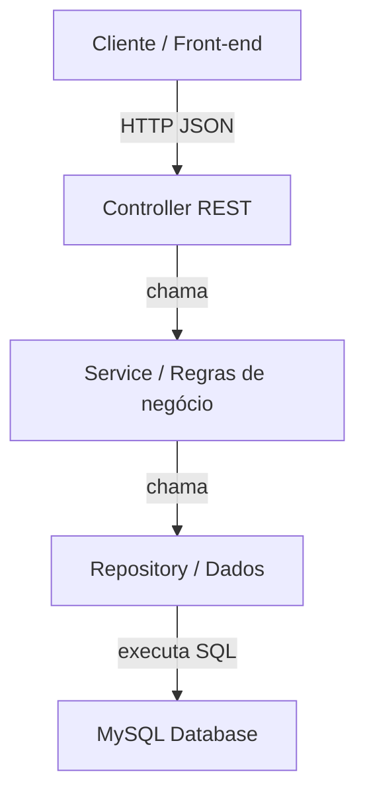
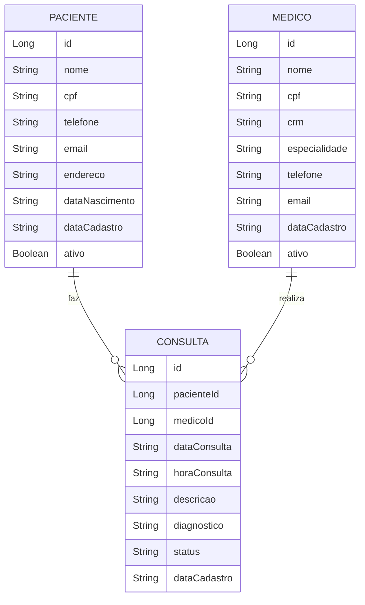
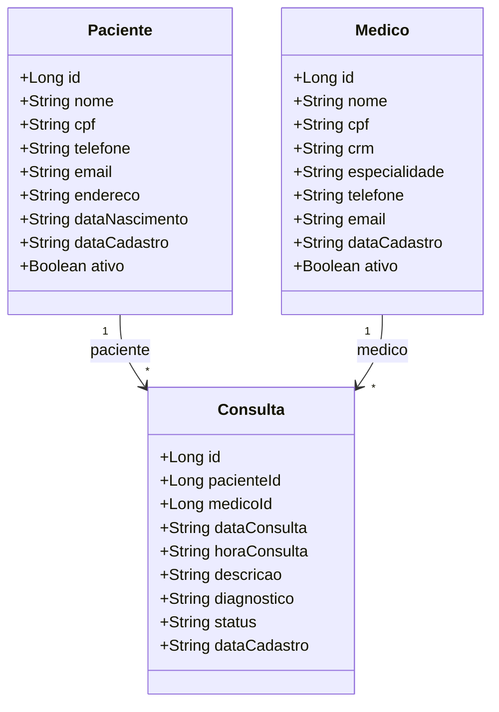

# Relatório Fase 2 e 3

## Fase 2 — Arquitetura da Aplicação

A solução foi desenvolvida como um **monólito em camadas**, seguindo o padrão clássico do Spring Boot. A arquitetura prioriza clareza, separação de responsabilidades e fácil manutenção.

### Objetivo da arquitetura

O principal objetivo é garantir que cada camada tenha uma responsabilidade única:

- **Controller**: expõe a API REST e mapeia as requisições HTTP para a lógica de negócio.
- **Service**: contém regras de negócio, validações e transformação de dados entre DTOs e entidades.
- **Repository**: acessa o banco de dados MySQL usando Spring Data JPA.
- **Model**: representa as entidades JPA do domínio clínico.
- **DTO**: separa a estrutura de entrada/saída do modelo persistido.
- **Exception**: centraliza o tratamento de erros e respostas padronizadas.
- **Config**: configurações transversais, como CORS.

### Pacotes do projeto

- `com.projetoBackEnd.sghss.controller`
- `com.projetoBackEnd.sghss.service`
- `com.projetoBackEnd.sghss.repository`
- `com.projetoBackEnd.sghss.model`
- `com.projetoBackEnd.sghss.dto`
- `com.projetoBackEnd.sghss.exception`
- `com.projetoBackEnd.sghss.config`

### Componentes principais

- `PacienteController`, `MedicoController`, `ConsultaController`
- `PacienteService`, `MedicoService`, `ConsultaService`
- `PacienteRepository`, `MedicoRepository`, `ConsultaRepository`
- `Paciente`, `Medico`, `Consulta`
- `PacienteDTO`, `MedicoDTO`, `ConsultaDTO`
- `GlobalExceptionHandler`, `ResourceNotFoundException`, `BusinessException`
- `WebConfig`

### Diagrama de camadas



### Por que essa arquitetura é adequada?

- promove **isolamento de responsabilidades**;
- facilita **teste unitário** e manutenção;
- permite **evolução incremental** do projeto;
- é compatível com o padrão exigido em trabalhos académicos de desenvolvimento Java/Spring.

---

## Fase 3 — Modelo de Dados e Diagramas

### Entidades do domínio

A solução considera três entidades principais:

- `Paciente`
- `Medico`
- `Consulta`

### Descrição das entidades

- `Paciente`: representa o utente do hospital, com CPF, contato e endereço.
- `Medico`: representa o profissional de saúde, com CRM, especialidade e contato.
- `Consulta`: registra o agendamento entre paciente e médico, com data, hora, status e diagnóstico.

### Relacionamentos do DER

- `Paciente` 1 → N `Consulta`
- `Medico` 1 → N `Consulta`

A `Consulta` funciona como ligação entre um paciente e um médico, mantendo o histórico de atendimentos.

### DER completo



### Diagrama de classes UML



### Notas sobre o modelo

- `Consulta` referencia `Paciente` e `Medico` através de chaves estrangeiras.
- O relacionamento 1:N permite que um paciente tenha várias consultas e um médico atenda vários pacientes.
- A utilização de `DTO` evita o envio direto de entidades JPA ao consumidor.

---

## Diagrama de Fluxo de Dados

```mermaid
sequenceDiagram
    participante Cliente
    participante Controller
    participant Service
    participant Repository
    participant MySQL

    Cliente->>Controller: POST /api/consultas
    Controller->>Service: criar(ConsultaDTO)
    Service->>Repository: save(Consulta)
    Repository->>MySQL: insert consulta
    MySQL-->>Repository: ok
    Repository-->>Service: Consulta salva
    Service-->>Controller: ConsultaDTO
    Controller-->>Cliente: 201 Created
```

---

## Considerações finais

- A arquitetura monolítica em camadas está implementada e estruturada para avaliação académica.
- O projeto usa Spring Boot, Spring Data JPA, MySQL e boas práticas de DTO/exception.
- O design garante separação entre apresentação, lógica de negócio e persistência.
- O relatório e os diagramas refletem o modelo de dados, os relacionamentos e o fluxo de requisições.
